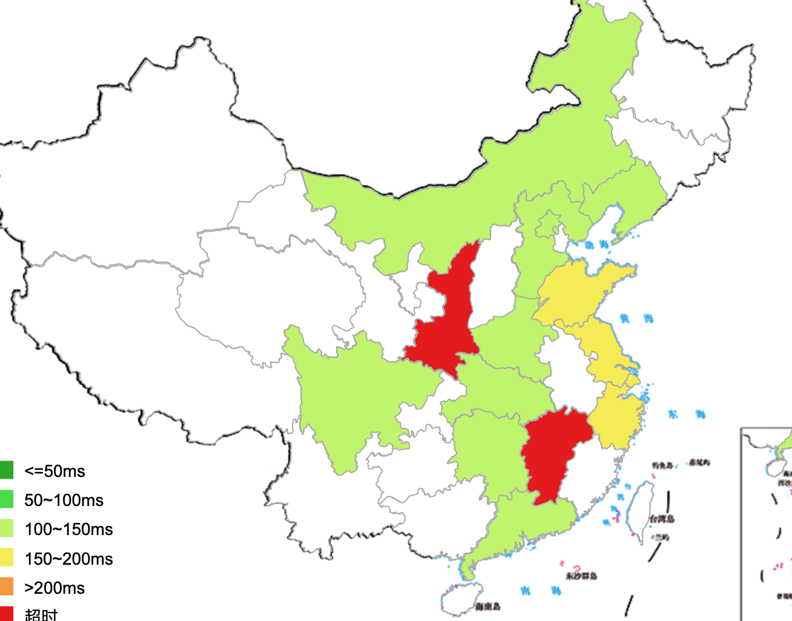

# 流浪中文同人圈：Github傻瓜自救指南

## ReadMe:

我知道github可以利用 **hexo**等开源软件配置漂亮的个站，并且有github.io域名。但是配置太过于麻烦了，尤其是对于电脑小白来说。因为github之强大常常会吓跑小白，所以这篇文章旨在利用github issue做一个 **被墙风险比wordpress**低的伪个站。

**注意！！！github的修改是可以被看见的！！！**

**注意！！！github的修改是可以被看见的！！！**

**注意！！！github的修改是可以被看见的！！！**

重要的事情说三遍

另外wordpress ping图：

部分地区不可用，并且普遍速度非常慢。

### 为什么使用github而不是用其他的网站？

github是一个为程序员提供交流平台的网站，国内信息科技行业对其依赖程度极高。曾今被墙过一次，因为有学者呼吁解禁否则会导致国内软件行业大退步而作罢。可以理解为大树底下好乘凉，或者挟天子令诸侯。相较之下更加安全。

### 那样不会给程序员添麻烦吗？：

第一，你在想什么那可是程序员。第二，github上从来不缺乏敏感repo，和黄比起来小巫见大巫。第三，github本身也有不少资源repo以及奇怪的“机器学习资源”。

### 啊，写代码的网站能写文吗？能写皇吗？

> We are committed to maintaining a community where users are free to express themselves and challenge one another's ideas, both technical and otherwise. 
>
> .......
>
> Sexually obscene content** - Don’t post content that is pornographic. This does not mean that all nudity, or all code and content related to sexuality, is prohibited. We recognize that sexuality is a part of life and non-pornographic sexual content may be a part of your project, or may be presented for educational or artistic purposes. We do not allow obscene sexual content or content that may involve the exploitation or sexualization of minors.

我抠脚翻译下：

我们承诺维护一个yan lun 自由，鼓励挑战他人想法的社区，**无论与技术相关与否**。

请不要上传pornographic。**这并不代表所有nudity，或者所有与sexuality有关的内容是被禁止的**。我们认为sexuality是生活的一部分，而non-pornographic sexual内容也许是你的项目的一部分，或者以教育的，**或者艺术目的而被展示**。我们不允许下流的sexual content或者对少数群体的性滥用。

即，与长佩相似，允许非纯rou。

*为什么我要用英文因为那些词不难然后lofter估计不给我发*

tos和community guidelines里均无说明只允许发布代码，并且同时有大量非代码repo发布在github上。

另外重要的一点是github删文，我们来看看他的tos：

> #### [2. GitHub May Remove Content](https://help.github.com/en/github/site-policy/github-terms-of-service#2-github-may-remove-content)
>
> We do not pre-screen User-Generated Content, but we have the right (though not the obligation) to refuse or remove any User-Generated Content that, in our sole discretion, violates any GitHub terms or policies.

## 极简教程：

#### 注册

点绿色键后会有一串不重要的调研，如实填写选择，用途选择host website就好

#### repo

进入后点绿色的new键

#### issue

点击issues

关于标签，label name = 标签名， description描述。颜色可以自己选

之后形式与贴吧相似。

**注意！！！github的修改是可以被看见的！！！**

**注意！！！github的修改是可以被看见的！！！**

**注意！！！github的修改是可以被看见的！！！**

重要的事情说三遍